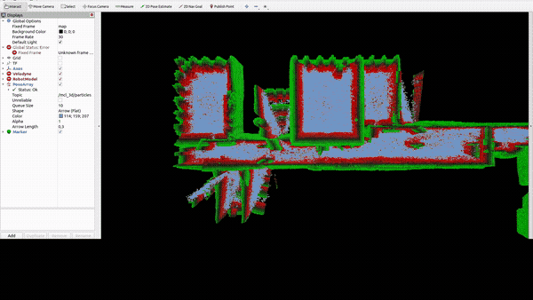

# tsdf_localization_demo

Example usage of the [tsdf_localization](https://github.com/uos/tsdf_localization_demo.git) package.

## Compilation

Requirements:
- ROS-noetic
- [tsdf_localization](https://github.com/uos/tsdf_localization)
- gazebo
- robot_pose_ekf

Clone this repository into your ROS(-noetic) workspace:

```console
$ git clone https://github.com/uos/tsdf_localization_demo.git
```

Build your workspace.

## Map preparation
Go to `tsdf_localization_demo/maps`-folder and enter

```console
$ bunzip2 avz_tsdf.h5.bz2
```

## Run TSDF MCL

Start a simulated robot by calling:

```console
$ roslaunch tsdf_localization_demo start_robot.launch
```

A window should open that looks like this:

TODO: image of gazebo


Next, run the TSDF MCL by calling:

```console
$ roslaunch tsdf_localization_demo mcl_3d.launch
```

The launch file starts
- mcl_3d
- visualization: 
    - RViz
    - tsdf_vis: h5 -> marker

It initially starts with an equally distributed belief state. Steer the robot until the particles are converging. Similar to [amcl](http://wiki.ros.org/amcl), you can initialize TSDF-MCL during runtime either by guessing the initial pose using RViz:



or by calling the service `/global_localization`:

```console
rosservice call /global_localization
```


